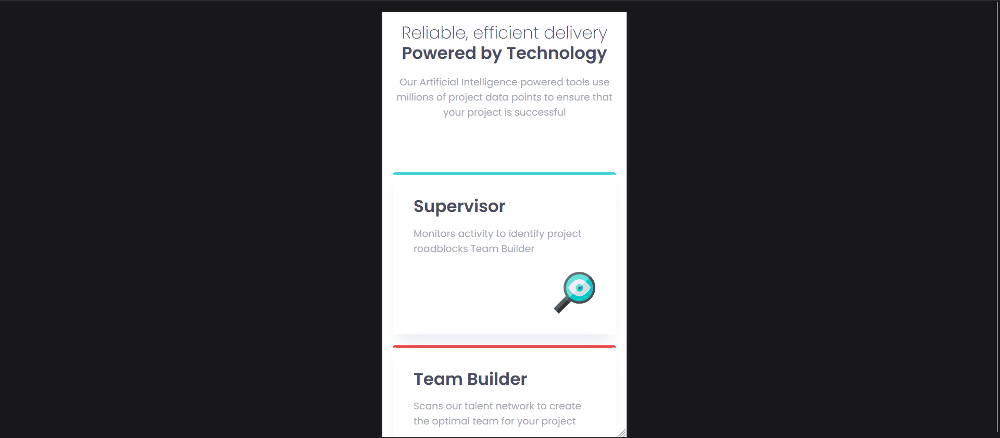

# Frontend Mentor - Four card feature section solution

This is a solution to the [Four card feature section challenge on Frontend Mentor](https://www.frontendmentor.io/challenges/four-card-feature-section-weK1eFYK). Frontend Mentor challenges help you improve your coding skills by building realistic projects. 

## Table of contents

- [Overview](#overview)
  - [Screenshot](#screenshot)
  - [Links](#links)
- [My process](#my-process)
  - [Built with](#built-with)
- [Author](#author)

## Overview

### Screenshot
**Desktop Preview**

**Mobile Preview**

### Links

- Solution URL: [Github Repo URL](https://github.com/Harry-Crocksick/four-card-section)
- Live Site URL: [Deployed site URL](https://marn-four-card.netlify.app/)

## My process
This challenge freshen up my HTML and CSS skill.

### Built with

- Semantic HTML5 markup
- CSS custom properties
- Mobile-first workflow

## Author

- Social Media - [Marn Tet Zan](https://www.facebook.com/james.christian.3914207)
- Frontend Mentor - [@Harry-Crocksick](https://www.frontendmentor.io/profile/Harry-Crocksick)